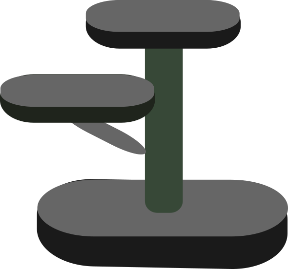

# xattree



[](https://github.com/modflowpy/xattree/actions/workflows/ci.yml)
[](https://xattree.readthedocs.io/en/latest/?badge=latest)
[](https://img.shields.io/github/contributors/modflowpy/xattree)

`attrs` + `xarray.DataTree` = `xattree`

"exa-tree", or "cat tree" if you like.

**Warning**: This project is experimental. It is *not* meant for production. Use at your own risk.

```python
import numpy as np
from numpy.typing import NDArray
from xattree import xattree, dim, array, field, ROOT 

@xattree
class Grid:
    x: int = dim(scope=ROOT, default=3)
    y: int = dim(scope=ROOT, default=3)

@xattree
class Arrs:
    a: NDArray[np.float64] = array(default=0.0, dims=("x", "y"))

@xattree
class Root:
    grid: Grid = field()
    arrs: Arrs = field()

grid = Grid()
root = Root(grid=grid)
arrs = Arrs(parent=root)
root.data
<xarray.DataTree 'root'>
Group: /
│   Dimensions:  (x: 3, y: 3)
│   Coordinates:
│     * x         (x) int64 24B 0 1 2
│     * y         (y) int64 24B 0 1 2
├── Group: /grid
│       Attributes:
│           x:        3
│           y:        3
└── Group: /arrs
        Dimensions:  (x: 3, y: 3)
        Data variables:
            a        (x, y) float64 72B 0.0 0.0 0.0 0.0 0.0 0.0 0.0 0.0 0.0
```
